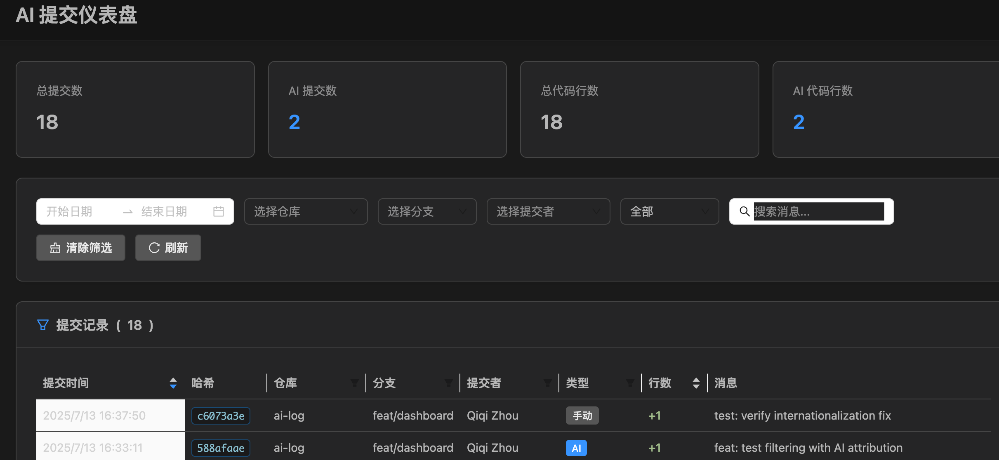

# AIlog

**AIlog** is a modern VS Code extension designed to intelligently track and visualize your AI-assisted coding activity. Built with a monorepo architecture using pnpm workspaces, it features advanced AI detection capabilities and provides a comprehensive React-based dashboard to analyze your productivity and the impact of AI tools on your development workflow.



## Features

### 🤖 **Advanced AI Detection**
- **Multi-dimensional Analysis**: Automatically detects AI-generated code using advanced algorithms
- **Pattern Recognition**: Identifies AI-generated code patterns, syntax completeness, and boilerplate structures
- **Time Proximity Detection**: Correlates code changes with AI command execution timing
- **Manual Override**: Simple status bar toggle for manual AI attribution when needed

### 📊 **Modern React Dashboard**
- **Rich Analytics**: Detailed metrics on AI-generated commits and code volume
- **Interactive Charts**: Built with Ant Design and Chart.js for beautiful visualizations
- **Smart Filtering**: Date range and message search with real-time filtering
- **Dark Theme**: Automatic VS Code theme integration with proper icon colors
- **Responsive Design**: Full-width layout that adapts to your screen
- **Internationalization**: Complete support for English and Chinese (中文)

### 🏗️ **Monorepo Architecture**
- **pnpm Workspaces**: Modern monorepo setup with efficient dependency management
- **SOLID Principles**: Clean, maintainable code following industry best practices
- **TypeScript**: Full type safety across all packages with shared type definitions
- **Modular Design**: Separate packages for extension, dashboard, and shared types
- **Build Optimization**: Parallel builds and optimized development workflow

### 🌍 **Enhanced User Experience**
- **Internationalization**: Full support for English and Chinese (中文)
- **Theme-Aware UI**: Automatic adaptation to VS Code themes
- **Offline Capability**: All dependencies bundled for offline operation
- **Human-in-the-Loop**: Interactive workflow for commit attribution decisions

### ⚙️ **Seamless Integration**
- **Automatic Git Hooks**: Installs pre-commit and post-commit hooks automatically
- **VS Code Integration**: Deep integration with VS Code's UI and workflow
- **Cross-Platform**: Works on Windows, macOS, and Linux
- **Database Storage**: Local SQLite database for fast, reliable data storage

## How It Works

AIlog uses a sophisticated multi-layered approach to detect and track AI-generated code:

1. **Real-time Detection**: Monitors your code changes and applies AI detection algorithms
2. **Git Hook Integration**: Automatically captures commit metadata through Git hooks
3. **Data Analysis**: Processes commit data using multiple analysis dimensions
4. **Dashboard Visualization**: Presents insights through an interactive web-based dashboard

## Installation

### From VS Code Marketplace
1. Install the **AIlog** extension from the VS Code Marketplace
2. Open a Git repository in VS Code
3. The extension will prompt you to install Git hooks - click **"Install Hook"**
4. Start coding and let AIlog track your AI-assisted development!

### Development Setup
```bash
# Clone the repository
git clone https://github.com/your-org/ailog.git
cd ailog

# Install dependencies (requires pnpm)
pnpm install

# Build all packages
pnpm build

# Package the extension
pnpm extension:package
```

## Usage

### Basic Workflow
1. **Automatic Detection**: AIlog automatically detects AI-generated code changes
2. **Manual Override**: Click the status bar toggle (`AI Generated: ❌/✅`) to manually mark commits
3. **Interactive Confirmation**: Before commits, choose whether to attribute them to AI
4. **Dashboard Analysis**: View your AI coding patterns in the comprehensive dashboard

### Commands
- `AIlog: Show Dashboard` - Opens the analytics dashboard
- `AIlog: Install Git Hook` - Installs Git hooks for automatic tracking
- `AIlog: Toggle AI Generated` - Manually toggle AI attribution for next commit
- `AIlog: Interactive Commit Check` - Interactive pre-commit AI attribution dialog

## Architecture Overview

AIlog is built as a modern monorepo with clear separation of concerns:

```
ai-log/
├── pnpm-workspace.yaml           # Workspace configuration
├── package.json                  # Root workspace config
├── packages/
│   ├── extension/                # VS Code Extension (@ailog/extension)
│   │   ├── src/
│   │   │   ├── database.ts       # SQLite operations
│   │   │   ├── extension.ts      # Main entry point
│   │   │   └── dashboard-dist/   # Built React dashboard (auto-generated)
│   │   └── package.json
│   ├── dashboard/                # React Dashboard (@ailog/dashboard)
│   │   ├── src/
│   │   │   ├── App.tsx           # Main React app
│   │   │   ├── components/       # React components
│   │   │   ├── hooks/            # Custom React hooks
│   │   │   ├── stores/           # Zustand state management
│   │   │   └── styles/           # Global styles & themes
│   │   └── package.json
│   └── shared/                   # Shared Types (@ailog/shared)
│       ├── src/types/            # TypeScript definitions
│       └── package.json
└── shared/                       # Additional shared resources
```

### Key Components

#### AI Detection System
- **Pattern Analyzer**: Identifies AI-generated code patterns
- **Syntax Analyzer**: Checks for complete, well-formed code structures
- **Comment Analyzer**: Evaluates comment quality and style
- **Boilerplate Analyzer**: Detects common code templates
- **Time Proximity Analyzer**: Correlates timing with AI tool usage

#### Service Layer
- **Git Services**: Handle repository operations and commit processing
- **UI Services**: Manage status bar, notifications, and dashboard
- **Detection Services**: Coordinate AI detection algorithms

#### Management Layer
- **Extension Manager**: Coordinates all services and manages lifecycle
- **Command Manager**: Handles VS Code command registration and execution
- **Document Change Manager**: Monitors and processes file changes

## Configuration

AIlog works out of the box with sensible defaults, but you can customize:

- **Detection Sensitivity**: Adjust AI detection thresholds
- **Language Support**: Enable/disable detection for specific languages
- **Dashboard Preferences**: Customize chart types and data visualization
- **Internationalization**: Switch between English and Chinese interfaces

## Data Storage

- **Local Database**: `~/.watch-cursor/commits.db` (SQLite)
- **Privacy-First**: All data stays on your machine
- **Efficient Storage**: Optimized database schema for fast queries
- **Backup-Friendly**: Standard SQLite format for easy backup/restore

## Development

AIlog is built with modern development practices:

### Technology Stack
- **Monorepo**: pnpm workspaces for efficient dependency management
- **TypeScript**: Full type safety across all packages
- **React**: Modern dashboard with Ant Design components
- **Vite**: Fast build tool for the dashboard
- **Zustand**: Lightweight state management
- **ESLint**: Code quality enforcement
- **VS Code Integration**: Deep integration with VS Code themes and APIs

### Available Scripts
```bash
# Build all packages
pnpm build

# Develop dashboard with hot reload
pnpm dashboard:dev

# Build and package extension
pnpm extension:package

# Run linting across all packages
pnpm lint

# Clean all build artifacts
pnpm clean
```

## Contributing

We welcome contributions! Please:

1. Follow the existing code style and architecture
2. Ensure TypeScript compilation passes
3. Run linting before submitting changes
4. Test thoroughly with the Extension Development Host
5. Update documentation and translations as needed

## License

This project is licensed under the MIT License - see the LICENSE file for details.

## Support

- 📖 Documentation: Check the [Development Guide](DEVELOPMENT.md)
- 🐛 Issues: Report bugs on GitHub Issues
- 💬 Discussions: Join our community discussions
- 📧 Contact: Reach out to the maintainers

---

**AIlog** - Intelligent AI-assisted development tracking for VS Code